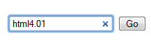
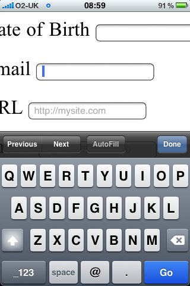

# Controls

For each piece of information that you want to the user to provide information for, you will want a control. This chapter describes the different controls that are at your disposal and how to use them to create and accessibility user-friendly experience.

## Text input

A field that allows you to type in information.

HTML:

	<label for="username">Username</label>
	<input type="text" id="username" name="username">

## Password input

Exactly the same as the text input except that when the user types you see dots as a security measure.

HTML:

	<label for="password">Password</label>
	<input type="password" id="password" name="password">

## Textarea

The text area is like a big text input but with the ability to type text over many lines. Use this when the user has a lot of information to type.

HTML:

	<label for="description">Description</label>
	<textarea name="description" id="description"></textarea>

## Select menu

This control provides a drop down menu where you can select one option from a list.

HTML:

	<label for="favouriteColor">Favourite colour</label>
	<select id="favouriteColor" name="favouriteColor">
		<option value="">Select colour</option>
		<option value="red">Red</option>
		<option value="blue">Blue</option>
		<option value="green">Green</option>
	</select>

### Multiple select

I> ## Important
I>
I> Don't use this control - use checkbox instead shown later

HTML:

	<label for="favouriteColors">Favourite colours</label>
	<select id="favouriteColors" name="favouriteColors" multiple>
		<option value="">Select colour</option>
		<option value="red">Red</option>
		<option value="blue">Blue</option>
		<option value="green">Green</option>
	</select>

### Grouping options

Dependening on the situation, grouping parts of a select menu's options is advisable. Take the following example. It is a list of cuisines. The most popular are grouped at the top for quick selection. Providing benefit to the user, by indicating how this large list is organised and how they can go about using it. Much better than a long list of ungrouped options.

	

		<label for="cuisine">Cuisine</label>
		<select id="cuisine" name="cuisine">
		    <option value="">Show everything</option>
		    <optgroup label="Most popular cuisines">
	            <option value="indian">Indian</option>
	            <option value="pizza">Pizza</option>
	            <option value="chinese">Chinese</option>
	            <option value="kebabs">Kebabs</option>
		    </optgroup>
		    <optgroup label="Other cuisines">
	            <option value="bangladeshi">Bangladeshi</option>
	            <option value="thai">Thai</option>
	            <option value="english">English</option>
		    </optgroup>
		</select>
	

### Select onchange problem

1. Inputting/selecting is very different from submission. Keep them separate.

2. Reference my article

## Search input

I> ## Important
I>
I> The search control, where unsupported degrades down to a text input.

When we talk about search, we’re not just talking about Google, Bing, or Yahoo. We’re talking about the search field on that e-commerce site you just made a purchase from, on Wikipedia, and even on your personal blog. It’s probably the most common action performed on the Web every day, yet it’s not marked up very semantically, is it? We all tend to write something like this:

	<input type="text" name="search">

Well, what if we could write something like …

	<input type="search" name="search">

With HTML5 we can. Feels much better, doesn’t it? Desktop browsers will render this in a similar way to a standard text field—until you start typing, that is. At this point, a small cross appears on the right side of the field. Notice the x in Figure 1. This lets you quickly clear the field, just like Safari’s built-in search field.

On a mobile device, however, things start to get interesting. Take the example iPhone shown in Figure 2; when you focus on an input using type="search", notice the keyboard, specifically the action button on the keyboard (bottom right). Did you spot that it says “Search” rather than the regular “Go”? It’s a subtle difference that most users won’t even notice, but those who do will afford themselves a wry smile.

As you’ve seen with the new attributes, browsers that don’t understand them will simply degrade gracefully. The same applies to all of the new input types discussed here. If a browser doesn’t understand type="search", it will default to type="text". This means you’re not losing anything. In fact, you’re using progressive enhancement and helping users to have a better experience. Let’s face it: filling out web forms isn’t very fun, so anything you can add to ensure a smoother experience, the better.

## Number input
## Email input

Did you notice it this time? No? Look at the keyboard again. That’s right, the keyboard is different. There are dedicated keys for the @ and . characters to help you complete the field more efficiently. As we discussed with type="search", there is no downside to using type="email" right now. If a browser doesn’t support it, it will degrade to type="text". And in some browsers, users will get a helping hand.

## Checkbox
## Radio
## Hidden input
## Buttons

1. Buttons, input type image

2. Buttons shouldnt have cursor: pointer

3. Don't make something look like a form element when it is not (affordance). Like Biscevic using radios for delivery

## Abstraction for design

### Simple control e.g. a username

What I am referring to as a *simple* control, is one that is made up of a label and a text control (or select menu). Anything other than a button, a checkbox or a radio.

In HTML this looks like:

	

		<label for="username">Username</label>
		<input id="username" name="username">
	

### Checkbox control e.g. agreeing to terms and conditions

This control pertains specifically to *one* checkbox. A group of checkboxes should not use this mark-up. The checkbox should appear first in the mark-up, with labels to the right, for accessibility and readability.

	

		<input type="checkbox" name="terms" id="terms">
		<label for="terms">Terms</label>
	

### Group control

Useful for a group of checkboxes or radios. A group requires a fieldset and legend at least for accessibility. Notice that each radio (or checkbox) is wrapped in a `div` with a class attribute value `control` because just like the checkbox control above, the group must conform in the same way. That is inputs to the left, labels to the right.

	

		<fieldset>
			<legend>Delivery or collection</legend>
			

				<input type="radio" name="delivery" id="delivery">
				<label for="delivery">Delivery</label>
			

			

				<input type="radio" name="delivery" id="collection">
				<label for="collection">Collection</label>
			

		</fieldset>
	

I> ## Important
I>
I> The `id` attribute value of the first control in the group, matches the `name` attribute value. This is essential for the client-side validation as we will see later.

### Action buttons

You must provide a submit button for everyform. No exceptions. This is expected, intuitive and required to work in all browsers without issue. It's standard and good practice.

This HTML allows you to place any primary (and secondary) call to actions. Typically this is placed at the end of the form.

	

		<input type="submit" value="Checkout" name="checkout">
	
