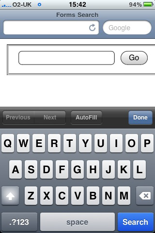

# Search input

	<input type="search" name="search">

Desktop browsers will render this in a similar way to a standard text field—until you start typing, that is. At this point, a small cross appears on the right side of the field. Notice the x in Figure 1. This lets you quickly clear the field, just like Safari’s built-in search field.

On a mobile device, however, things start to get interesting. Take the example iPhone shown in Figure 2; when you focus on an input using type="search", notice the keyboard, specifically the action button on the keyboard (bottom right). Did you spot that it says “Search” rather than the regular “Go”? It’s a subtle difference that most users won’t even notice, but those who do will afford themselves a wry smile.

If a browser doesn’t understand type="search", it will default to type="text". This means you’re not losing anything. In fact, you’re using progressive enhancement and helping users to have a better experience. Let’s face it: filling out web forms isn’t very fun, so anything you can add to ensure a smoother experience, the better.
